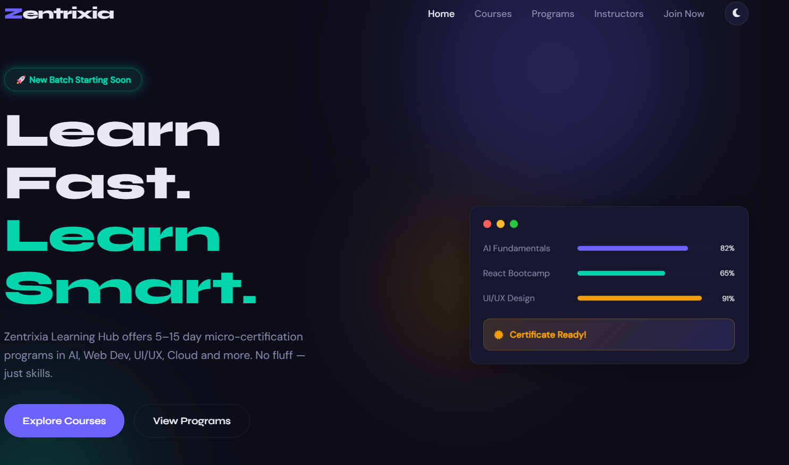
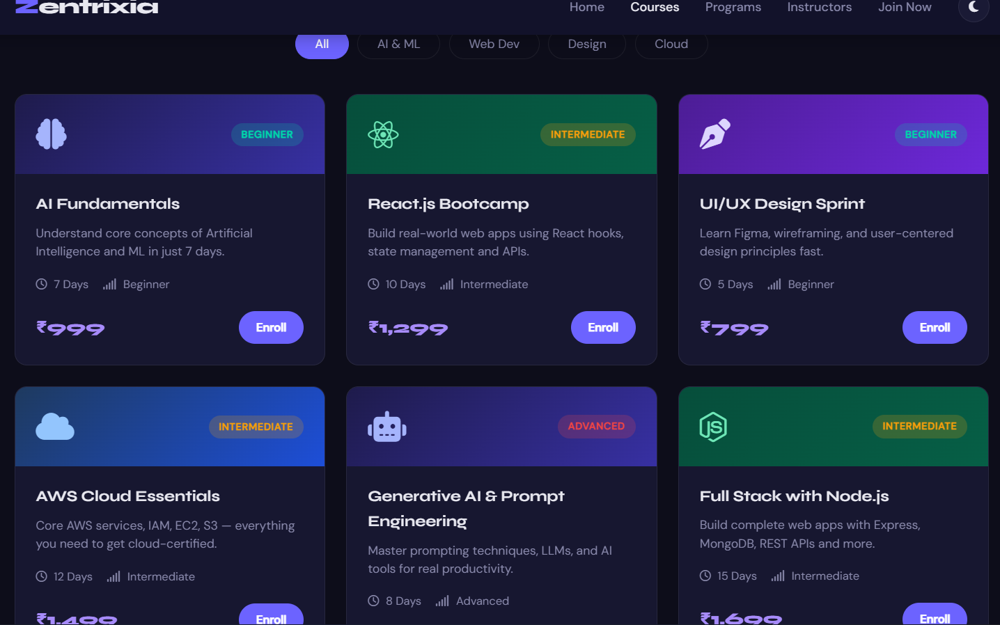
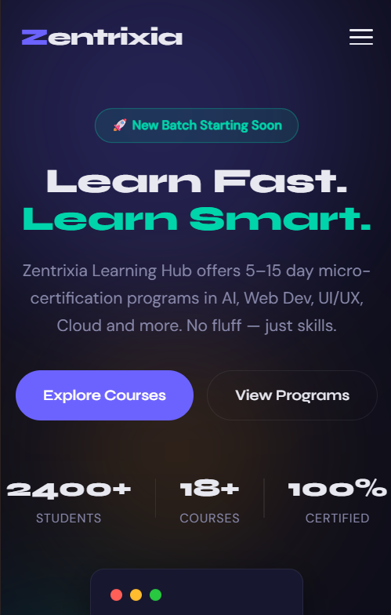
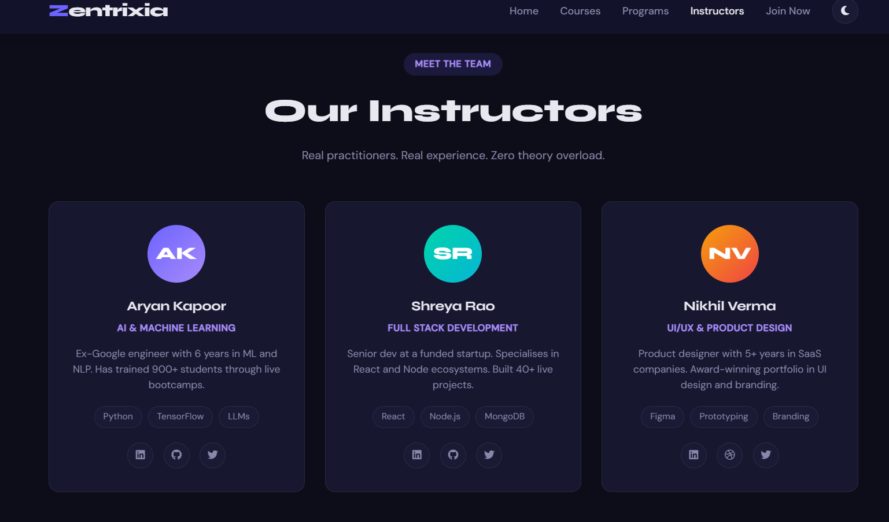

A fully responsive front-end website for *Zentrixia Learning Hub* — a fictional futuristic educational platform offering micro-certification programs in tech and digital skills.

Built as part of the *Info Bharat Internship Program*.

---

## 📸 Sections

| Section | Description |
|---|---|
| *Home / Hero* | Animated welcome banner with stats and mock dashboard preview |
| *Courses* | 6 course cards with filter by category (AI, Web, Design, Cloud) |
| *Programs* | 3 signature learning tracks with certification badges |
| *Instructors* | 3 instructor profile cards with social links |
| *Join Now* | Enrollment form with validation and success state |
| *Footer* | Social links, quick navigation, newsletter input |

---

## 🛠️ Tech Stack

- HTML5
- CSS3 (Flexbox + Grid, CSS Variables, custom animations)
- Vanilla JavaScript (no frameworks)
- [AOS.js](https://michalsnik.github.io/aos/) — scroll animations
- [Font Awesome 6](https://fontawesome.com/) — icons
- [Google Fonts](https://fonts.google.com/) — Syne + DM Sans

---

## ✨ Features

- ✅ Fully responsive (mobile, tablet, desktop)
- ✅ Dark / Light mode toggle (saved to localStorage)
- ✅ Smooth scroll + sticky navbar with scroll effect
- ✅ Course filter by category
- ✅ AOS scroll-triggered animations
- ✅ Mock dashboard card with animated progress bars
- ✅ Form with validation + success state
- ✅ Scroll to top button

---

## 📁 Folder Structure

zentrixia-learning-hub/
├── index.html
├── css/
│   └── style.css
├── js/
│   └── main.js
└── README.md

---

## 🚀 How to Run

Just open index.html in any browser. No build step needed.

Or deploy free to GitHub Pages:
1. Push to GitHub
2. Go to *Settings → Pages*
3. Set source to main branch → / (root)
4. Your site will be live at https://yourusername.github.io/zentrixia-learning-hub/

---

## 📋 Company Details (Fictional)

- *Platform Name:* Zentrixia Learning Hub
- *Tagline:* Learn Fast. Learn Smart.
- *Email:* hello@zentrixia.tech
- *Hours:* Mon–Fri, 10:00 AM – 9:00 PM IST
- *Focus:* Short-term learning + Certifications

---

This is a fictional brand created for an internship task. All content is mock/demo only.

## Screenshots

### Home Page

### Courses

### mobileview

### Instructors

### Mobile View

